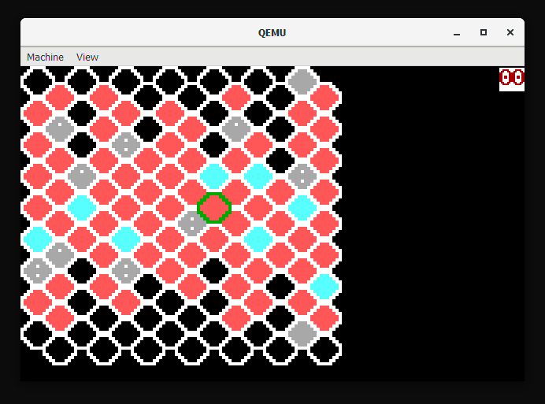

hexsector
=========
[**> Download floppy.img <**](https://github.com/The6P4C/hexsector/releases/download/v1.0/floppy.img)

A boot sector sized (510 byte) clone of the game [Hexcells](https://store.steampowered.com/app/265890/Hexcells/). Cheap as chips, great puzzle game - pick it up if you haven't already.

The source code of the game ([main.asm](main.asm)) is extensively commented: please check it out! I've tried to explain why things are written how they are (probably optimisation) and it should be readable if you're semi-familiar with x86 assembly but rusty on real-mode shenanigans.

  
**Left:** game grid, dots in grey cells indicate neighbour count  
**Right:** mistakes counter

## Building
Run `make` inside the repository directory. This will require `nasm` and `python` to be installed, and I can't guarantee it'll work on a non-Linux box.

`floppy.img` will be created - this is a raw 3½" floppy disk image that can be used in QEMU, Bochs, VirtualBox (may need to be renamed to `floppy.dsk`), VMware, or even put onto a real floppy (?).

To change maps, change the value loaded into `cl` before the `int 0x13` call in `main.asm` from between 0x0002 and 0x0005. Each map is stored as successive sectors on the disk after the boot sector.

## Controls
Use `WSAD` to move the cursor (green outlined hexagon) over the cell you want to guess/discover. Press `O` to attempt to uncover a blue cell (left click in the original game) or `P` to attempt to uncover a grey cell (right click in the original game).

## Running
QEMU: `qemu-system-i386 -drive file=floppy.img,format=raw,index=0,if=floppy`

Bochs `bochsrc.txt`: line 1 = `floppya: 1_44=floppy.img,status=inserted`, line 2 = `boot: floppy`, run `bochs -qf bochsrc.txt`

VirtualBox: rename `floppy.img` to `floppy.dsk`, assign as media for floppy drive
